# FCND-Term1-P4-Controls-CPP

In this project, a cascaded PID controller for a quadrotor drone was implemented in C++. The control method in this project is based on what we have learned in the lectures and the following diagram depicts the controller.

## C++ implementation

We have been given the following tasks:

1) Complete various control functions of a [pre-written drone simulator project by Udcaity](https://github.com/udacity/FCND-Controls-CPP). The implemented control functions are accessible in [/cpp_src/src/QuadControl.cpp](./cpp_src/src/QuadControl.cpp) 

2) Tune the control parameters and test the drone control capabilities in a 5 different flight scenarios. The control parameters can be tuned in [/cpp_src/config/QuadControlParams.txt](./QuadControlParams.txt). The current values for the control parameters are the final tuned ones found after many trial and error runs.

### Scenario 1: Intro

In this introductory task, the only objective was to tune the mass parameter of the drone in [/cpp_src/src/QuadControl.cpp](./cpp_src/src/QuadControl.cpp) until it can hover for a brief amount of time. 

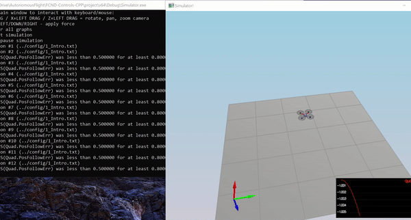

### Scenario 2: Body rate and roll/pitch control

'GenerateMotorCommands()' is the first function to complete. The purpose of this method is to convert a desired 3-axis moment and collective thrust command to individual motor thrust commands. 

Based on the orientation of each individual rotor and its direction of rotation, the following 4 equations can be written:

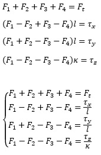

where all four F variables are motor thrusts, all tau variables are moments about three axes, and F_t is the collective thrust. Kappa parameter is the drag/thrust ratio.
The system of 4 equations and 4 unknow thrust can be solved as:

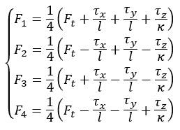

The implementation of this method can be found in [/cpp_src/src/QuadControl.cpp](./cpp_src/src/QuadControl.cpp) lines 78 - 87

The next step is to complete 'BodyRateControl() and RollPitchControl()' methods: 

To calculate the desired pitch and roll angle rates based on a desired global lateral acceleration, the current attitude of the quad, and desired collective thrust command, we can consider:

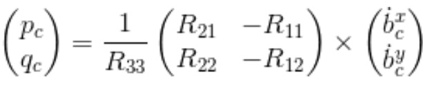

and 

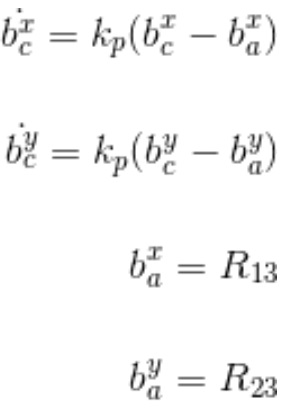

After implementing the mentioned formulation and tuning the parameters, scenario 2 was test and successfully passed, as shown below:

The implementation of these methods can be found in [/cpp_src/src/QuadControl.cpp](./cpp_src/src/QuadControl.cpp) lines 107 - 120 and 153 - 166. 

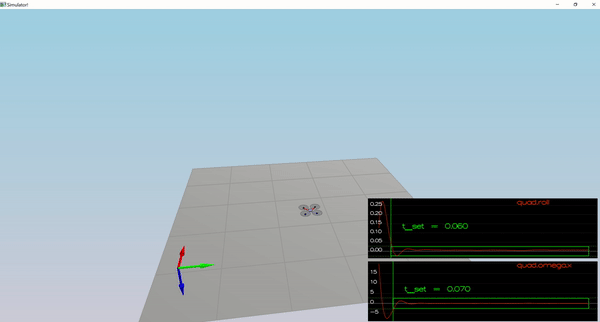

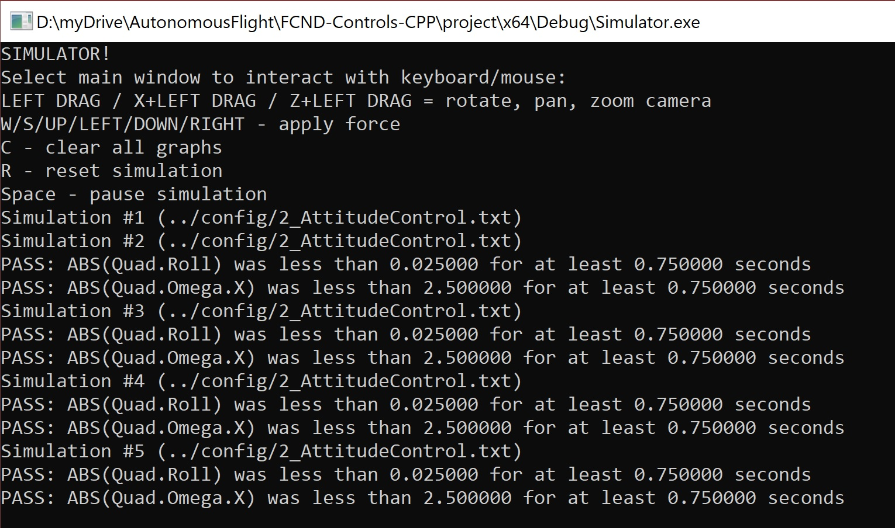

### Scenario 3: Position/velocity and yaw angle control

The remaining three methods "AltitudeControl(), LateralPositionControl(), and YawControl()" are needed to be completed so the quad can perform scenario 3, 4, and 5. 

The following PD controller formulation can be written for altitude control.

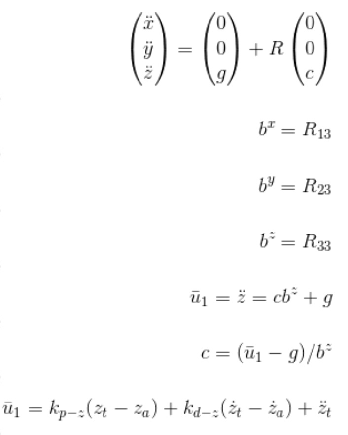

Similar controller methods for lateral and yaw control were written. It should be noted that these two method are in fact a P control.

The implementation of these methods can be found in [/cpp_src/src/QuadControl.cpp](./cpp_src/src/QuadControl.cpp) lines 197 - 211,  249 - 271, and 294 - 308.

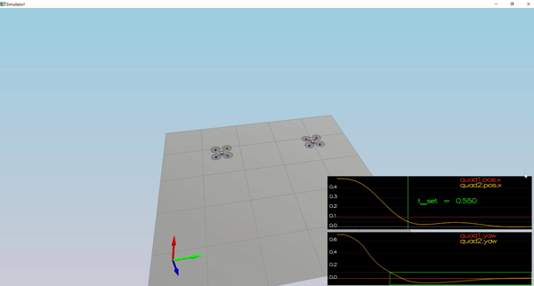

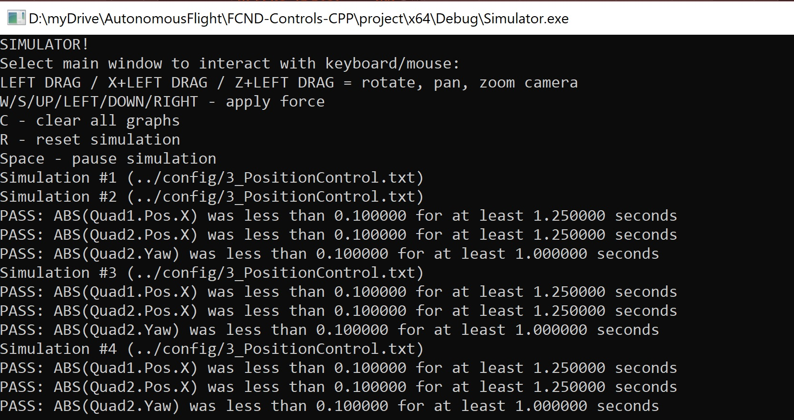

### Scenario 4: Non-idealities and robustness

In this scenario, due to variation in weight and even the location of center of mass, the normal PD altitude controller would not be enough. Therefore the integral term of the control equation was added to altitude controller. So we actually moved from PD to PID controller. However, the simple addition of an integrated error term and just tuning its single parameter could not capture the reality.
Thus, a new tune-up for most of the parameters were required. and surprising, after tuning all the parameters the drones were able to accomplish their paths.

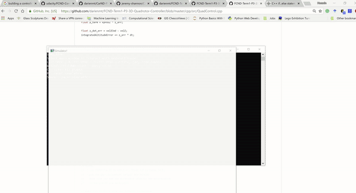

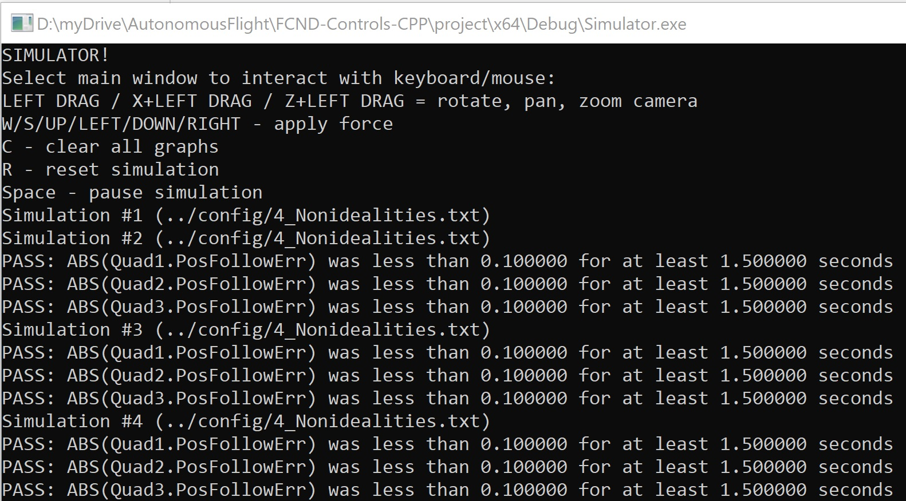

### Scenario 5: Tracking trajectories

Here it can be seen that the drone controller and the tuned parameters are capable of navigating a complex path as in scenario 5. 

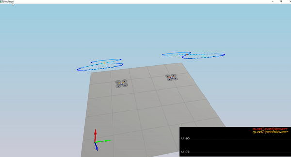

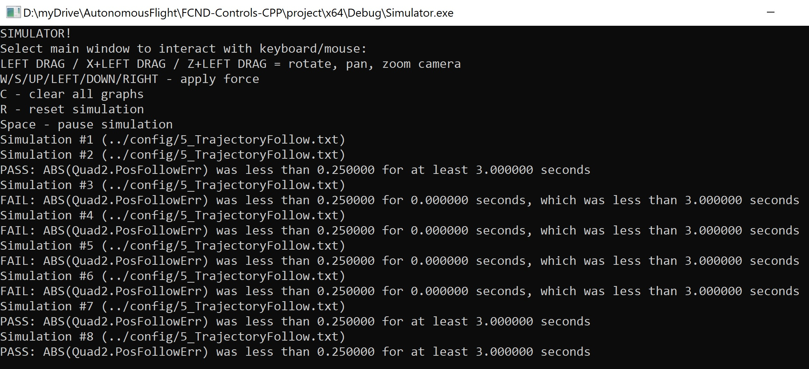
