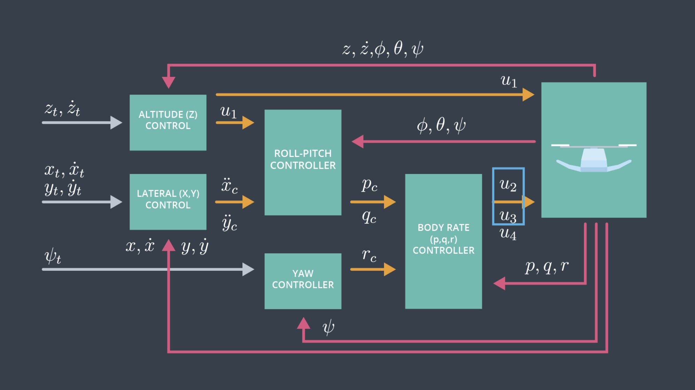

# FCND-Term1-P4-Controls-CPP

In this project, a cascaded PID controller for a quadrotor drone was implemented in C++. The control method in this project is based on what we have learned in the lectures and the following diagram depicts the controller.

